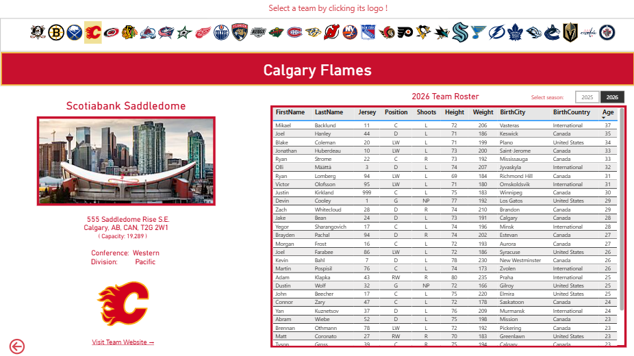
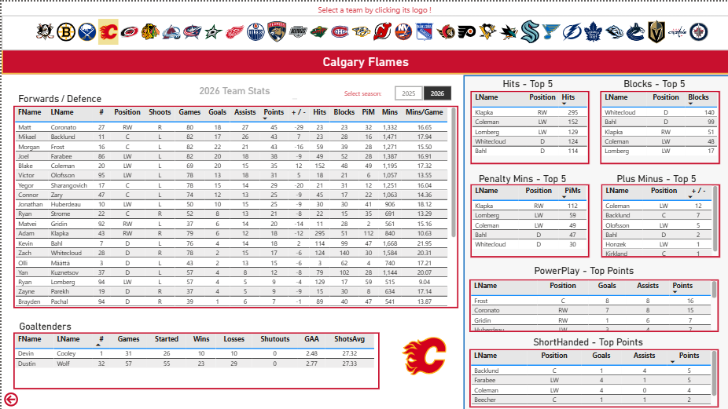
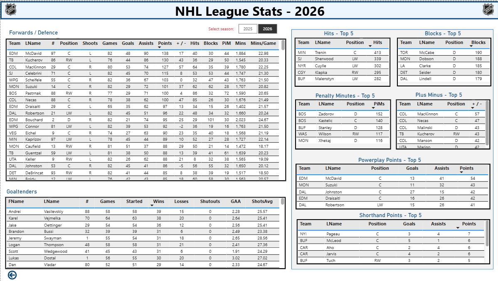
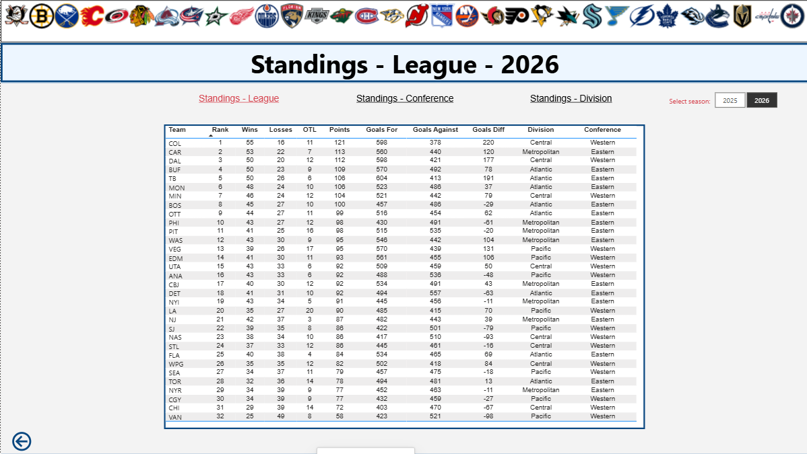
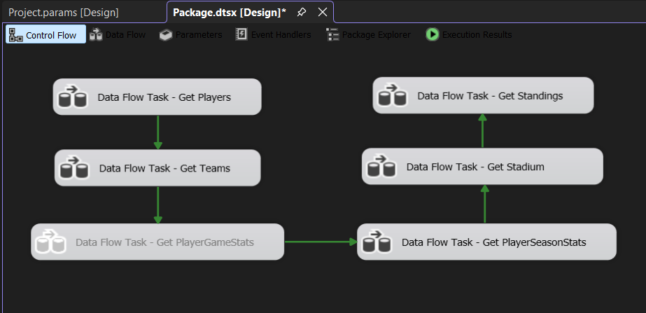

# NHL Season Summary

An end-to-end NHL analytics project using SQL Server Integration Services (SSIS), C#, SQL Server, Power Query, DAX, and Power BI.

The project extracts NHL data from the SportsData.io API, parses JSON responses in SSIS Script Components, loads the data into SQL Server, and presents the results through an interactive Power BI report.


## Live Power BI Report

Explore the interactive NHL Season Summary report in Power BI:

[View the Live Power BI Report](https://app.powerbi.com/view?r=eyJrIjoiYjY0ODBiNjktYTgwYS00NzE3LWJkMDEtMGRlMjM4NTRlNmEzIiwidCI6IjlkZjE5Yjk5LTY1NjItNDA4NC04OTlmLWY3NzcxZWNmNDMzNyJ9&pageName=20bc6d44301f5f7002fc)

> The published report is provided for portfolio demonstration purposes. Data availability and refreshes depend on the underlying SportsData.io API.


## Project Architecture

SportsData.io API  
→ SSIS Script Components (C# / JSON parsing)  
→ SQL Server  
→ Power Query / Data Model  
→ Power BI

## Technologies

- SQL Server Integration Services (SSIS)
- C#
- Newtonsoft.Json
- REST APIs
- SQL Server
- T-SQL
- Power Query
- DAX
- Power BI
- Git / GitHub

## Data Pipeline

The SSIS package contains six sequential Data Flow Tasks:

1. Get Players
2. Get Teams
3. Get PlayerGameStats
4. Get PlayerSeasonStats
5. Get Stadium
6. Get Standings

Each API-based data flow follows the same general pattern:

API request  
→ deserialize JSON into C# objects  
→ write rows to the SSIS pipeline  
→ load data into SQL Server using an OLE DB Destination

Flat-file connection managers are also used for error logging.

## SQL Server

The SQL Server database includes:

- `dbo.Players`
- `dbo.Teams`
- `dbo.PlayerGameStats`
- `dbo.PlayerSeasonStats`
- `dbo.Stadium`
- `dbo.SeasonStandings`

SQL scripts for creating and validating these tables are included in the `sql_scripts` folder.

## Power BI

The Power BI report contains:

- Team Overview
- Team Season
- League Season
- League Standings
- Conference Standings
- Division Standings
- League Stats

The report includes team and player analysis, league leaders, standings, roster information, arena information, and player demographic statistics.


## Screenshots

### Team Overview



### Team Stats



### League Stats



### League Standings



### SSIS Data Pipeline

The SSIS package orchestrates six sequential data flows that retrieve NHL data, transform the API responses, and load the results into SQL Server.




## Reference Data

The Power BI model also uses small reference datasets for:

- Canadian regions
- Arena photo URLs
- Geographic enrichment

The external world-cities source used during development is intentionally excluded from the repository.

## API Configuration

The SportsData.io API key is not stored in the repository.

The SSIS project uses the project parameter:

`SportsDataApiKey`

Set this parameter to your own valid SportsData.io API key before running the package.

SportsData.io access may vary by subscription and season. Some endpoints used in the original project require the most recent season to be specified.

## Repository Structure

```text
NHL_Analytics/
├── data/
│   └── reference/
├── power_bi/
├── sql_scripts/
├── Package.dtsx
├── Project.params
├── NHL_Project2.dtproj
├── NHL_Project2.slnx
└── README.md